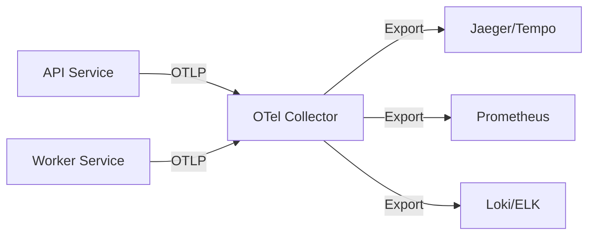

# Monitoring & Observability

Real Staging AI is fully instrumented with OpenTelemetry for comprehensive observability.

## Overview

The platform exports three types of telemetry data:

- **Traces** - Request flow and performance across services
- **Metrics** - System health and business KPIs
- **Logs** - Structured application events

## OpenTelemetry Setup

### Architecture



### Configuration

OpenTelemetry Collector config (`infra/otelcol.yaml`):

```yaml
receivers:
  otlp:
    protocols:
      grpc:
        endpoint: 0.0.0.0:4317
      http:
        endpoint: 0.0.0.0:4318

processors:
  batch:
    timeout: 10s
    send_batch_size: 1024

exporters:
  debug: {}
  prometheus:
    endpoint: "0.0.0.0:8889"
  jaeger:
    endpoint: "jaeger:14250"
    tls:
      insecure: true
  loki:
    endpoint: "http://loki:3100/loki/api/v1/push"

service:
  pipelines:
    traces:
      receivers: [otlp]
      processors: [batch]
      exporters: [debug] # Use debug exporter for development, jaeger for production
    metrics:
      receivers: [otlp]
      processors: [batch]
      exporters: [prometheus]
    logs:
      receivers: [otlp]
      processors: [batch]
      exporters: [loki]
```

**Important:** The OTLP receiver must listen on `0.0.0.0` (all interfaces) to accept connections from other Docker containers. The default `127.0.0.1` will only accept localhost connections within the collector container itself.

**Environment Variables:**

Services must set `OTEL_EXPORTER_OTLP_ENDPOINT` to point to the collector:

```yaml
# docker-compose.yml
services:
  api:
    environment:
      - OTEL_EXPORTER_OTLP_ENDPOINT=http://otel:4318
  worker:
    environment:
      - OTEL_EXPORTER_OTLP_ENDPOINT=http://otel:4318
```

The telemetry initialization code automatically parses full URLs and extracts the host:port for the OpenTelemetry SDK.

## Distributed Tracing

### Key Traces

**API Request Flow:**

```
HTTP Request
├── JWT Validation
├── Database Query (get user)
├── S3 Presign Operation
└── Redis Enqueue
```

**Worker Job Processing:**

```
Job Dequeue
├── Database Update (status = processing)
├── S3 Download (original image)
├── Replicate API Call
│   └── AI Model Inference
├── S3 Upload (staged image)
└── Database Update (status = ready)
```

### Viewing Traces

With Jaeger (development):

```bash
# Start Jaeger
docker run -d --name jaeger \
  -p 16686:16686 \
  -p 14250:14250 \
  jaegertracing/all-in-one:latest

# Open UI
open http://localhost:16686
```

### Trace Attributes

All traces include:

| Attribute          | Description        | Example            |
| ------------------ | ------------------ | ------------------ |
| `service.name`     | Service identifier | `real-staging-api` |
| `trace.id`         | Unique trace ID    | `a1b2c3d4...`      |
| `span.kind`        | Span type          | `SERVER`, `CLIENT` |
| `http.method`      | HTTP method        | `POST`             |
| `http.status_code` | Response code      | `200`              |
| `db.system`        | Database type      | `postgresql`       |
| `user.id`          | User identifier    | `user_abc123`      |

## Metrics

### Application Metrics

**API Service:**

- `http_requests_total` - Request count by endpoint, method, status
- `http_request_duration_seconds` - Request latency histogram
- `jwt_validation_failures_total` - Authentication failures
- `s3_presign_operations_total` - Presigned URL generations
- `redis_enqueue_operations_total` - Jobs enqueued

**Worker Service:**

- `jobs_processed_total` - Jobs completed by status
- `job_processing_duration_seconds` - Job duration histogram
- `replicate_api_calls_total` - AI API calls
- `s3_operations_total` - S3 uploads/downloads
- `image_processing_errors_total` - Errors by type

**Infrastructure:**

- `go_goroutines` - Active goroutines
- `go_memstats_alloc_bytes` - Memory allocation
- `process_cpu_seconds_total` - CPU usage

### Viewing Metrics

With Prometheus:

```bash
# Start Prometheus
docker run -d --name prometheus \
  -p 9090:9090 \
  -v $(pwd)/prometheus.yml:/etc/prometheus/prometheus.yml \
  prom/prometheus

# Open UI
open http://localhost:9090
```

### Example Queries

```promql
# Request rate (per second)
rate(http_requests_total[5m])

# P95 latency
histogram_quantile(0.95, rate(http_request_duration_seconds_bucket[5m]))

# Error rate
rate(http_requests_total{status=~"5.."}[5m])

# Job processing throughput
rate(jobs_processed_total{status="completed"}[5m])

# Average job duration
rate(job_processing_duration_seconds_sum[5m]) / rate(job_processing_duration_seconds_count[5m])
```

## Structured Logging

### Log Format

All logs use structured JSON:

```json
{
  "timestamp": "2025-10-12T20:30:00Z",
  "level": "info",
  "service": "api",
  "trace_id": "abc123",
  "span_id": "def456",
  "user_id": "user_xyz",
  "message": "Image created successfully",
  "image_id": "img_123",
  "project_id": "proj_456",
  "duration_ms": 45
}
```

### Log Levels

| Level   | Usage                      | Example                         |
| ------- | -------------------------- | ------------------------------- |
| `debug` | Detailed debugging info    | Parameter values, state changes |
| `info`  | Normal operations          | Request received, job completed |
| `warn`  | Recoverable issues         | Retry attempt, deprecated usage |
| `error` | Errors requiring attention | API failures, database errors   |
| `fatal` | Critical failures          | Service cannot start            |

### Viewing Logs

**Development:**

```bash
# View all logs
docker compose logs -f

# Filter by service
docker compose logs -f api
docker compose logs -f worker

# Search logs
docker compose logs | grep ERROR
```

**Production (with Loki):**

```bash
# Query logs
logcli query '{service="api"}' --limit=100

# Filter by level
logcli query '{service="api", level="error"}'

# Search in message
logcli query '{service="api"} |= "Image created"'
```

## Dashboards

### Grafana Dashboard

Create a dashboard to visualize key metrics:

**Panels:**

1. **Request Rate** - Requests per second
2. **Response Time** - P50, P95, P99 latencies
3. **Error Rate** - 4xx and 5xx errors
4. **Job Queue Length** - Pending jobs in Redis
5. **Job Processing Time** - Worker performance
6. **Database Connections** - Pool usage
7. **Memory Usage** - Heap allocation
8. **Goroutines** - Concurrency monitoring

### Complete Grafana Dashboard

Full dashboard JSON for import (`grafana-dashboard.json`):

```json
{
  "dashboard": {
    "title": "Real Staging AI - Production",
    "tags": ["realstaging", "production"],
    "timezone": "utc",
    "refresh": "30s",
    "time": {
      "from": "now-6h",
      "to": "now"
    },
    "panels": [
      {
        "id": 1,
        "title": "Request Rate (req/sec)",
        "type": "graph",
        "gridPos": { "x": 0, "y": 0, "w": 12, "h": 8 },
        "targets": [
          {
            "expr": "sum(rate(http_requests_total[5m])) by (method, endpoint)",
            "legendFormat": "{{method}} {{endpoint}}"
          }
        ]
      },
      {
        "id": 2,
        "title": "Response Time (P50, P95, P99)",
        "type": "graph",
        "gridPos": { "x": 12, "y": 0, "w": 12, "h": 8 },
        "targets": [
          {
            "expr": "histogram_quantile(0.50, sum(rate(http_request_duration_seconds_bucket[5m])) by (le))",
            "legendFormat": "P50"
          },
          {
            "expr": "histogram_quantile(0.95, sum(rate(http_request_duration_seconds_bucket[5m])) by (le))",
            "legendFormat": "P95"
          },
          {
            "expr": "histogram_quantile(0.99, sum(rate(http_request_duration_seconds_bucket[5m])) by (le))",
            "legendFormat": "P99"
          }
        ]
      },
      {
        "id": 3,
        "title": "Error Rate (%)",
        "type": "graph",
        "gridPos": { "x": 0, "y": 8, "w": 8, "h": 8 },
        "targets": [
          {
            "expr": "sum(rate(http_requests_total{status=~\"5..\"}[5m])) / sum(rate(http_requests_total[5m])) * 100",
            "legendFormat": "5xx Error Rate"
          }
        ]
      },
      {
        "id": 4,
        "title": "Job Queue Length",
        "type": "graph",
        "gridPos": { "x": 8, "y": 8, "w": 8, "h": 8 },
        "targets": [
          {
            "expr": "redis_queue_length",
            "legendFormat": "Pending Jobs"
          }
        ]
      },
      {
        "id": 5,
        "title": "Job Processing Time (seconds)",
        "type": "graph",
        "gridPos": { "x": 16, "y": 8, "w": 8, "h": 8 },
        "targets": [
          {
            "expr": "histogram_quantile(0.95, sum(rate(job_processing_duration_seconds_bucket[5m])) by (le))",
            "legendFormat": "P95"
          }
        ]
      },
      {
        "id": 6,
        "title": "Database Connection Pool",
        "type": "graph",
        "gridPos": { "x": 0, "y": 16, "w": 12, "h": 8 },
        "targets": [
          {
            "expr": "pgx_pool_acquire_count",
            "legendFormat": "Acquired"
          },
          {
            "expr": "pgx_pool_idle_conns",
            "legendFormat": "Idle"
          },
          {
            "expr": "pgx_pool_max_conns",
            "legendFormat": "Max"
          }
        ]
      },
      {
        "id": 7,
        "title": "Memory Usage (MB)",
        "type": "graph",
        "gridPos": { "x": 12, "y": 16, "w": 12, "h": 8 },
        "targets": [
          {
            "expr": "go_memstats_alloc_bytes / 1024 / 1024",
            "legendFormat": "Heap Allocated"
          }
        ]
      },
      {
        "id": 8,
        "title": "Active Goroutines",
        "type": "graph",
        "gridPos": { "x": 0, "y": 24, "w": 8, "h": 8 },
        "targets": [
          {
            "expr": "go_goroutines",
            "legendFormat": "Goroutines"
          }
        ]
      },
      {
        "id": 9,
        "title": "Jobs Processed (success vs failure)",
        "type": "graph",
        "gridPos": { "x": 8, "y": 24, "w": 8, "h": 8 },
        "targets": [
          {
            "expr": "sum(rate(jobs_processed_total{status=\"completed\"}[5m]))",
            "legendFormat": "Completed"
          },
          {
            "expr": "sum(rate(jobs_processed_total{status=\"failed\"}[5m]))",
            "legendFormat": "Failed"
          }
        ]
      },
      {
        "id": 10,
        "title": "S3 Operations Rate",
        "type": "graph",
        "gridPos": { "x": 16, "y": 24, "w": 8, "h": 8 },
        "targets": [
          {
            "expr": "sum(rate(s3_operations_total{operation=\"upload\"}[5m]))",
            "legendFormat": "Uploads"
          },
          {
            "expr": "sum(rate(s3_operations_total{operation=\"download\"}[5m]))",
            "legendFormat": "Downloads"
          }
        ]
      }
    ]
  }
}
```

**Import to Grafana:**

```bash
# Via UI: Dashboards → Import → Upload JSON
# Or via API:
curl -X POST http://localhost:3000/api/dashboards/db \
  -H "Content-Type: application/json" \
  -H "Authorization: Bearer $GRAFANA_API_KEY" \
  -d @grafana-dashboard.json
```

## Alerting

### Key Alerts

**High Priority:**

```yaml
# High error rate
- alert: HighErrorRate
  expr: rate(http_requests_total{status=~"5.."}[5m]) > 0.05
  for: 5m
  annotations:
    summary: "High API error rate"

# Worker queue backup
- alert: JobQueueBackup
  expr: redis_queue_length > 1000
  for: 10m
  annotations:
    summary: "Job queue backing up"

# Database connection pool exhaustion
- alert: DBPoolExhausted
  expr: pgx_pool_idle_conns / pgx_pool_max_conns < 0.1
  for: 5m
  annotations:
    summary: "Database connection pool nearly exhausted"
```

**Medium Priority:**

```yaml
# Slow response times
- alert: SlowAPIResponses
  expr: histogram_quantile(0.95, rate(http_request_duration_seconds_bucket[5m])) > 2
  for: 10m

# High memory usage
- alert: HighMemoryUsage
  expr: go_memstats_alloc_bytes / go_memstats_sys_bytes > 0.9
  for: 10m
```

###Complete Prometheus Alert Rules

Save as `prometheus-alerts.yml`:

```yaml
groups:
  - name: realstaging_api
    interval: 30s
    rules:
      # Critical - Service Down
      - alert: APIServiceDown
        expr: up{job="api"} == 0
        for: 1m
        labels:
          severity: critical
          component: api
        annotations:
          summary: "API service is down"
          description: "The API service has been down for more than 1 minute"
          runbook: "https://docs.realstaging.ai/operations/troubleshooting#api-down"

      # Critical - High Error Rate
      - alert: HighErrorRate
        expr: |
          sum(rate(http_requests_total{status=~"5.."}[5m])) 
          / 
          sum(rate(http_requests_total[5m])) > 0.05
        for: 5m
        labels:
          severity: critical
          component: api
        annotations:
          summary: "High API error rate: {{ $value | humanizePercentage }}"
          description: "More than 5% of requests are failing"
          runbook: "https://docs.realstaging.ai/operations/troubleshooting#high-error-rate"

      # Critical - Slow Responses
      - alert: HighLatency
        expr: |
          histogram_quantile(0.95, 
            sum(rate(http_request_duration_seconds_bucket[5m])) by (le)
          ) > 1
        for: 10m
        labels:
          severity: warning
          component: api
        annotations:
          summary: "P95 latency is {{ $value }}s"
          description: "95th percentile response time exceeds 1 second"

      # High - Database Connection Pool Exhaustion
      - alert: DBConnectionPoolExhausted
        expr: |
          pgx_pool_idle_conns / pgx_pool_max_conns < 0.1
        for: 5m
        labels:
          severity: high
          component: database
        annotations:
          summary: "Database connection pool nearly exhausted"
          description: "Only {{ $value | humanizePercentage }} connections available"
          runbook: "https://docs.realstaging.ai/operations/troubleshooting#db-pool-exhausted"

      # High - Authentication Failures
      - alert: HighAuthFailureRate
        expr: |
          sum(rate(jwt_validation_failures_total[5m])) > 10
        for: 5m
        labels:
          severity: high
          component: auth
        annotations:
          summary: "High authentication failure rate"
          description: "{{ $value }} JWT validation failures per second"

  - name: realstaging_worker
    interval: 30s
    rules:
      # Critical - Worker Down
      - alert: WorkerServiceDown
        expr: up{job="worker"} == 0
        for: 1m
        labels:
          severity: critical
          component: worker
        annotations:
          summary: "Worker service is down"
          description: "The worker service has been down for more than 1 minute"
          runbook: "https://docs.realstaging.ai/operations/troubleshooting#worker-down"

      # High - Job Queue Backup
      - alert: JobQueueBackup
        expr: redis_queue_length > 1000
        for: 10m
        labels:
          severity: high
          component: worker
        annotations:
          summary: "Job queue has {{ $value }} pending jobs"
          description: "Worker is falling behind, queue backing up"
          runbook: "https://docs.realstaging.ai/operations/troubleshooting#queue-backup"

      # High - Job Processing Failures
      - alert: HighJobFailureRate
        expr: |
          sum(rate(jobs_processed_total{status="failed"}[5m])) 
          / 
          sum(rate(jobs_processed_total[5m])) > 0.05
        for: 10m
        labels:
          severity: high
          component: worker
        annotations:
          summary: "{{ $value | humanizePercentage }} of jobs are failing"
          description: "Job failure rate exceeds 5%"
          runbook: "https://docs.realstaging.ai/operations/troubleshooting#job-failures"

      # Warning - Slow Job Processing
      - alert: SlowJobProcessing
        expr: |
          histogram_quantile(0.95,
            sum(rate(job_processing_duration_seconds_bucket[5m])) by (le)
          ) > 30
        for: 15m
        labels:
          severity: warning
          component: worker
        annotations:
          summary: "P95 job processing time is {{ $value }}s"
          description: "Jobs taking longer than expected to process"

      # High - Replicate API Errors
      - alert: ReplicateAPIErrors
        expr: |
          sum(rate(replicate_api_calls_total{status="error"}[5m])) > 1
        for: 5m
        labels:
          severity: high
          component: replicate
        annotations:
          summary: "Replicate API errors: {{ $value }}/s"
          description: "AI model API is experiencing errors"
          runbook: "https://docs.realstaging.ai/operations/troubleshooting#replicate-errors"

  - name: realstaging_infrastructure
    interval: 30s
    rules:
      # Warning - High Memory Usage
      - alert: HighMemoryUsage
        expr: |
          go_memstats_alloc_bytes / go_memstats_sys_bytes > 0.85
        for: 10m
        labels:
          severity: warning
          component: infrastructure
        annotations:
          summary: "Memory usage at {{ $value | humanizePercentage }}"
          description: "Service may run out of memory soon"

      # Warning - High CPU Usage
      - alert: HighCPUUsage
        expr: |
          rate(process_cpu_seconds_total[5m]) > 0.8
        for: 10m
        labels:
          severity: warning
          component: infrastructure
        annotations:
          summary: "CPU usage at {{ $value | humanizePercentage }}"
          description: "Service experiencing high CPU load"

      # Warning - Goroutine Leak
      - alert: GoroutineLeak
        expr: |
          go_goroutines > 10000
        for: 10m
        labels:
          severity: warning
          component: infrastructure
        annotations:
          summary: "{{ $value }} goroutines running"
          description: "Possible goroutine leak detected"

  - name: realstaging_storage
    interval: 60s
    rules:
      # High - S3 Upload Failures
      - alert: HighS3UploadFailureRate
        expr: |
          sum(rate(s3_operations_total{operation="upload",status="error"}[5m])) 
          / 
          sum(rate(s3_operations_total{operation="upload"}[5m])) > 0.05
        for: 5m
        labels:
          severity: high
          component: s3
        annotations:
          summary: "S3 upload failure rate: {{ $value | humanizePercentage }}"
          description: "More than 5% of S3 uploads are failing"

      # Warning - S3 Download Failures
      - alert: S3DownloadFailures
        expr: |
          sum(rate(s3_operations_total{operation="download",status="error"}[5m])) > 1
        for: 5m
        labels:
          severity: warning
          component: s3
        annotations:
          summary: "S3 download failures: {{ $value }}/s"
          description: "Errors downloading images from S3"

  - name: realstaging_business
    interval: 60s
    rules:
      # Info - Low Usage
      - alert: LowDailyUsage
        expr: |
          sum(increase(jobs_processed_total{status="completed"}[24h])) < 10
        labels:
          severity: info
          component: business
        annotations:
          summary: "Only {{ $value }} jobs processed in 24 hours"
          description: "Daily job volume is unusually low"

      # Info - High Subscription Churn
      - alert: HighSubscriptionCancellations
        expr: |
          sum(increase(stripe_subscription_canceled_total[24h])) > 5
        labels:
          severity: info
          component: business
        annotations:
          summary: "{{ $value }} subscriptions canceled in 24 hours"
          description: "Higher than normal cancellation rate"
```

**Load Alert Rules:**

```yaml
# prometheus.yml
rule_files:
  - "prometheus-alerts.yml"

alerting:
  alertmanagers:
    - static_configs:
        - targets: ["alertmanager:9093"]
```

## Health Checks

### API Health Endpoint

```bash
curl http://localhost:8080/health
```

**Response:**

```json
{
  "status": "healthy",
  "database": "connected",
  "redis": "connected",
  "uptime_seconds": 3600
}
```

### Kubernetes Probes

```yaml
livenessProbe:
  httpGet:
    path: /health
    port: 8080
  initialDelaySeconds: 10
  periodSeconds: 10

readinessProbe:
  httpGet:
    path: /health
    port: 8080
  initialDelaySeconds: 5
  periodSeconds: 5
```

## Performance Monitoring

### Key Performance Indicators

| KPI                 | Target  | Alert Threshold |
| ------------------- | ------- | --------------- |
| API P95 latency     | < 500ms | > 1s            |
| API error rate      | < 1%    | > 5%            |
| Job processing time | < 15s   | > 30s           |
| Job success rate    | > 98%   | < 95%           |
| Database query time | < 50ms  | > 200ms         |

### Bottleneck Identification

Use traces to identify slow operations:

1. **Database queries** - Add indexes, optimize queries
2. **External API calls** - Implement caching, retries
3. **S3 operations** - Use presigned URLs, parallel uploads
4. **CPU-bound operations** - Profile with pprof, optimize algorithms

## Debugging

### Enable Debug Logging

```bash
# Set log level
export LOG_LEVEL=debug

# Restart service
docker compose restart api worker
```

### CPU Profiling

```go
import _ "net/http/pprof"

// In main.go
go func() {
    log.Println(http.ListenAndServe("localhost:6060", nil))
}()
```

Access profiles:

```bash
# CPU profile
go tool pprof http://localhost:6060/debug/pprof/profile

# Heap profile
go tool pprof http://localhost:6060/debug/pprof/heap

# Goroutines
go tool pprof http://localhost:6060/debug/pprof/goroutine
```

## Complete Metrics Catalog

### API Metrics

| Metric Name                      | Type      | Labels                         | Description                    |
| -------------------------------- | --------- | ------------------------------ | ------------------------------ |
| `http_requests_total`            | Counter   | `method`, `endpoint`, `status` | Total HTTP requests            |
| `http_request_duration_seconds`  | Histogram | `method`, `endpoint`           | Request latency distribution   |
| `jwt_validation_failures_total`  | Counter   | `reason`                       | Failed authentication attempts |
| `s3_presign_operations_total`    | Counter   | `operation`, `status`          | Presigned URL generations      |
| `redis_enqueue_operations_total` | Counter   | `queue`, `status`              | Jobs enqueued to Redis         |
| `db_query_duration_seconds`      | Histogram | `query_type`                   | Database query latency         |
| `db_connections_active`          | Gauge     | -                              | Active database connections    |
| `db_connections_idle`            | Gauge     | -                              | Idle database connections      |

### Worker Metrics

| Metric Name                       | Type      | Labels                | Description                                 |
| --------------------------------- | --------- | --------------------- | ------------------------------------------- |
| `jobs_processed_total`            | Counter   | `status`              | Jobs completed (completed, failed, timeout) |
| `job_processing_duration_seconds` | Histogram | `model`               | Job processing time                         |
| `replicate_api_calls_total`       | Counter   | `model`, `status`     | AI API calls to Replicate                   |
| `replicate_api_duration_seconds`  | Histogram | `model`               | AI inference latency                        |
| `s3_operations_total`             | Counter   | `operation`, `status` | S3 uploads/downloads                        |
| `s3_operation_duration_seconds`   | Histogram | `operation`           | S3 operation latency                        |
| `image_processing_errors_total`   | Counter   | `error_type`          | Processing errors by type                   |
| `redis_queue_length`              | Gauge     | `queue`               | Pending jobs in queue                       |

### Infrastructure Metrics

| Metric Name                     | Type    | Labels | Description                     |
| ------------------------------- | ------- | ------ | ------------------------------- |
| `go_goroutines`                 | Gauge   | -      | Number of goroutines            |
| `go_threads`                    | Gauge   | -      | Number of OS threads            |
| `go_memstats_alloc_bytes`       | Gauge   | -      | Bytes allocated (heap)          |
| `go_memstats_sys_bytes`         | Gauge   | -      | Bytes obtained from system      |
| `go_memstats_heap_objects`      | Gauge   | -      | Number of heap objects          |
| `go_gc_duration_seconds`        | Summary | -      | GC pause duration               |
| `process_cpu_seconds_total`     | Counter | -      | CPU time consumed               |
| `process_resident_memory_bytes` | Gauge   | -      | Resident memory size            |
| `process_open_fds`              | Gauge   | -      | Number of open file descriptors |

### Business Metrics

| Metric Name                          | Type    | Labels               | Description                  |
| ------------------------------------ | ------- | -------------------- | ---------------------------- |
| `users_created_total`                | Counter | `source`             | New user signups             |
| `images_processed_total`             | Counter | `room_type`, `style` | Images successfully staged   |
| `stripe_checkouts_total`             | Counter | `plan`, `status`     | Checkout sessions            |
| `stripe_subscriptions_active`        | Gauge   | `plan`               | Active subscriptions by tier |
| `stripe_subscription_canceled_total` | Counter | `plan`, `reason`     | Subscription cancellations   |
| `revenue_total_cents`                | Counter | `plan`               | Total revenue in cents       |

## Log Aggregation Setup

### Loki (Grafana's Log Aggregation)

**Docker Compose Setup:**

```yaml
# docker-compose.yml
services:
  loki:
    image: grafana/loki:latest
    ports:
      - "3100:3100"
    volumes:
      - ./loki-config.yml:/etc/loki/local-config.yaml
      - loki-data:/loki
    command: -config.file=/etc/loki/local-config.yaml

  promtail:
    image: grafana/promtail:latest
    volumes:
      - /var/log:/var/log
      - ./promtail-config.yml:/etc/promtail/config.yml
    command: -config.file=/etc/promtail/config.yml
```

**Loki Configuration (`loki-config.yml`):**

```yaml
auth_enabled: false

server:
  http_listen_port: 3100

ingester:
  lifecycler:
    address: 127.0.0.1
    ring:
      kvstore:
        store: inmemory
      replication_factor: 1
  chunk_idle_period: 5m
  chunk_retain_period: 30s

schema_config:
  configs:
    - from: 2024-01-01
      store: boltdb-shipper
      object_store: filesystem
      schema: v11
      index:
        prefix: index_
        period: 24h

storage_config:
  boltdb_shipper:
    active_index_directory: /loki/index
    cache_location: /loki/index_cache
    shared_store: filesystem
  filesystem:
    directory: /loki/chunks

limits_config:
  enforce_metric_name: false
  reject_old_samples: true
  reject_old_samples_max_age: 168h # 7 days

chunk_store_config:
  max_look_back_period: 720h # 30 days

table_manager:
  retention_deletes_enabled: true
  retention_period: 720h # 30 days
```

**Query Logs:**

```bash
# Install logcli
brew install logcli

# Query all logs
logcli query '{service="api"}'

# Filter by level
logcli query '{service="api", level="error"}'

# Search message content
logcli query '{service="worker"} |= "job completed"'

# Regex search
logcli query '{service="api"} |~ "status=[45].."'

# Time range
logcli query '{service="api"}' --since=1h --until=now
```

### ELK Stack (Alternative)

**Elasticsearch, Logstash, Kibana setup:**

```yaml
services:
  elasticsearch:
    image: docker.elastic.co/elasticsearch/elasticsearch:8.11.0
    environment:
      - discovery.type=single-node
      - xpack.security.enabled=false
    ports:
      - "9200:9200"

  logstash:
    image: docker.elastic.co/logstash/logstash:8.11.0
    volumes:
      - ./logstash.conf:/usr/share/logstash/pipeline/logstash.conf
    ports:
      - "5000:5000"

  kibana:
    image: docker.elastic.co/kibana/kibana:8.11.0
    ports:
      - "5601:5601"
```

## Service Level Objectives (SLOs)

### Defined SLOs

| Service  | SLI                   | Target  | Measurement Window |
| -------- | --------------------- | ------- | ------------------ |
| API      | Availability          | 99.9%   | 30 days            |
| API      | Latency (P95)         | < 500ms | 7 days             |
| API      | Error rate            | < 1%    | 24 hours           |
| Worker   | Job success rate      | > 98%   | 7 days             |
| Worker   | Processing time (P95) | < 20s   | 24 hours           |
| Database | Query latency (P95)   | < 100ms | 24 hours           |

### SLI Calculations

**Availability:**

```promql
# Percentage of successful requests
sum(rate(http_requests_total{status!~"5.."}[30d]))
/
sum(rate(http_requests_total[30d]))
```

**Latency (P95):**

```promql
# 95th percentile response time
histogram_quantile(0.95,
  sum(rate(http_request_duration_seconds_bucket[7d])) by (le)
)
```

**Error Rate:**

```promql
# Percentage of failed requests
sum(rate(http_requests_total{status=~"5.."}[24h]))
/
sum(rate(http_requests_total[24h]))
```

### Error Budget

**99.9% availability = 0.1% error budget**

Over 30 days:

- Total time: 43,200 minutes
- Allowed downtime: 43.2 minutes
- Error budget consumption tracking:

```promql
# Error budget remaining
1 - (
  sum(rate(http_requests_total{status=~"5.."}[30d]))
  /
  sum(rate(http_requests_total[30d]))
) / 0.001
```

## Cost Monitoring

### Cloud Costs to Track

1. **Compute (API + Worker)**

   - Container/VM hours
   - CPU/memory allocation
   - Auto-scaling costs

2. **Database (PostgreSQL)**

   - Instance hours
   - Storage GB-months
   - IOPS/throughput
   - Backups

3. **Redis**

   - Instance hours
   - Memory allocation

4. **S3 Storage**

   - Storage GB-months
   - PUT/GET requests
   - Data transfer out

5. **AI API (Replicate)**

   - Model inference time
   - Per-image costs
   - API request volume

6. **Monitoring Stack**
   - Prometheus/Grafana hosting
   - Log storage (Loki/ELK)
   - Trace storage (Jaeger/Tempo)

### Cost Optimization Queries

**Most expensive AI model:**

```promql
# Total inference time by model (cost proxy)
sum(increase(replicate_api_duration_seconds_sum[30d])) by (model)
```

**S3 request volume:**

```promql
# Total S3 operations (correlates to request costs)
sum(increase(s3_operations_total[30d])) by (operation)
```

**Database connection efficiency:**

```promql
# Average connection pool utilization
avg(pgx_pool_acquire_count) / avg(pgx_pool_max_conns)
```

### Cost Alerts

```yaml
# High AI API usage
- alert: HighReplicateCosts
  expr: |
    sum(increase(replicate_api_calls_total[24h])) > 1000
  labels:
    severity: warning
    component: cost
  annotations:
    summary: "{{ $value }} AI API calls in 24 hours"
    description: "Replicate costs may be higher than expected"
```

## Incident Response Runbook

### Incident Severity Levels

| Level             | Impact              | Response Time | Example                                      |
| ----------------- | ------------------- | ------------- | -------------------------------------------- |
| **P0 - Critical** | Service down        | < 15 min      | API completely unavailable                   |
| **P1 - High**     | Major degradation   | < 1 hour      | 50%+ error rate, slow responses              |
| **P2 - Medium**   | Partial degradation | < 4 hours     | Single endpoint failing                      |
| **P3 - Low**      | Minor issues        | < 24 hours    | Elevated error rate on non-critical endpoint |

### Response Procedures

#### P0: Service Down

**1. Immediate Actions (0-15 minutes):**

```bash
# Check service status
kubectl get pods -n realstaging
docker ps

# Check recent logs for crash
kubectl logs -n realstaging -l app=api --tail=100
docker logs virtual-staging-ai-api-1 --tail=100

# Check health endpoints
curl https://api.realstaging.ai/health

# Restart service (if crash detected)
kubectl rollout restart deployment/api -n realstaging
docker compose restart api
```

**2. Escalation:**

- Notify #incidents Slack channel
- Page on-call engineer if not acknowledged in 5 minutes
- Update status page: https://status.realstaging.ai

**3. Root Cause Analysis:**

- Review recent deployments
- Check infrastructure alerts (CPU, memory, disk)
- Review external dependencies (database, Redis, S3, Replicate)
- Check for DDoS or unusual traffic patterns

#### P1: High Error Rate

**1. Immediate Actions:**

```bash
# Identify failing endpoints
kubectl logs -n realstaging -l app=api | grep "ERROR" | tail -50

# Check database connections
psql $DATABASE_URL -c "SELECT count(*) FROM pg_stat_activity;"

# Check Redis connectivity
redis-cli -h $REDIS_HOST ping

# Check S3 access
aws s3 ls s3://$S3_BUCKET_NAME
```

**2. Mitigation:**

- Scale up resources if needed
- Enable rate limiting if traffic spike
- Rollback recent deployment if correlated
- Switch to backup database if primary is degraded

#### P2: Partial Degradation

**1. Investigation:**

```bash
# Identify affected endpoint
grep "ERROR" logs | awk '{print $5}' | sort | uniq -c | sort -rn

# Check endpoint-specific metrics
curl "http://prometheus:9090/api/v1/query?query=rate(http_requests_total{endpoint='/api/v1/images',status=~'5..'}[5m])"

# Review traces
# Open Jaeger UI and search for slow/failed requests
```

**2. Resolution:**

- Fix identified issue
- Deploy fix
- Monitor for 30 minutes
- Close incident if resolved

### Post-Incident Review

Within 48 hours of P0/P1 incidents:

1. **Document timeline** - What happened when
2. **Root cause** - Why it happened
3. **Impact** - Users affected, duration, revenue loss
4. **Resolution** - How it was fixed
5. **Action items** - Prevent recurrence
6. **Follow-up** - Assign owners, set deadlines

**Template:** `docs/incidents/YYYY-MM-DD-incident-name.md`

## Best Practices

✅ Use correlation IDs to track requests across services  
✅ Log structured data, not string concatenation  
✅ Include context in error messages  
✅ Monitor business metrics, not just infrastructure  
✅ Set up alerts before incidents occur  
✅ Review dashboards regularly  
✅ Keep log retention reasonable (30-90 days)  
✅ Use sampling for high-traffic traces  
✅ Define clear SLOs and track error budgets  
✅ Practice incident response procedures  
✅ Conduct post-incident reviews  
✅ Monitor costs alongside performance

❌ Don't log sensitive data (tokens, passwords)  
❌ Don't over-alert (alert fatigue)  
❌ Don't ignore metrics trends  
❌ Don't skip health checks  
❌ Don't deploy without monitoring in place  
❌ Don't ignore cost metrics

## Monitoring Checklist

Before going to production:

- [ ] OpenTelemetry exporter configured
- [ ] Prometheus scraping all services
- [ ] Grafana dashboard imported
- [ ] Alert rules loaded into Prometheus
- [ ] Alertmanager configured with notification channels
- [ ] Log aggregation (Loki/ELK) set up
- [ ] Log retention policy configured
- [ ] SLOs defined and tracked
- [ ] Health check endpoints tested
- [ ] Incident response runbook documented
- [ ] On-call rotation established
- [ ] Status page configured
- [ ] Cost monitoring alerts enabled

---

**Related:**

- [Deployment Guide](deployment.md)
- [Troubleshooting Guide](deployment.md#troubleshooting-deployments)
- [Configuration](../guides/configuration.md)
