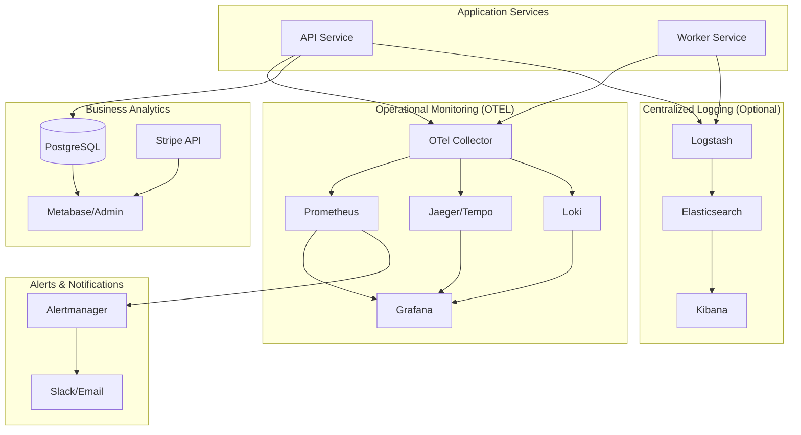

# Visibility & Analytics Strategy

This guide covers how to gain comprehensive insights into your SaaS platform - from operational metrics to business intelligence.

## Overview

Real Staging AI has **three layers of visibility**:

1. **Operational Monitoring** (OTEL) - System health, performance, errors
2. **Business Analytics** (To Build) - Users, revenue, usage patterns
3. **Centralized Logging** (ELK Stack) - Debugging, auditing, compliance

## What You Have Now: Operational Monitoring

Your OTEL setup provides excellent **technical visibility**:

### ✅ What OTEL Metrics Give You

**System Performance:**
- Request rates, latency (P50, P95, P99)
- Error rates and types
- Job processing throughput
- Database connection pool usage
- Memory/CPU utilization

**Infrastructure Health:**
- Service uptime
- Queue depths (Redis)
- S3 operation success rates
- Replicate API call performance
- Goroutine counts, memory leaks

**Example Queries:**
```promql
# How many images are being processed per hour?
sum(increase(jobs_processed_total{status="completed"}[1h]))

# What's my API error rate?
sum(rate(http_requests_total{status=~"5.."}[5m])) / sum(rate(http_requests_total[5m]))

# Average job processing time
rate(job_processing_duration_seconds_sum[5m]) / rate(job_processing_duration_seconds_count[5m])
```

### ❌ What OTEL Metrics DON'T Give You

OTEL metrics are **event-based counters**, not a **queryable database**. They tell you:
- "10 users signed up in the last hour" ✅
- But NOT "Show me all users who signed up this month" ❌
- "5 subscriptions canceled today" ✅  
- But NOT "Which users are on the Pro plan?" ❌
- "100 images processed" ✅
- But NOT "Which user processed the most images?" ❌

**You need a separate analytics layer for business intelligence.**

---

## What You Need: Business Analytics

Build an **admin analytics dashboard** with direct database queries.

### Key Business Questions to Answer

#### User Intelligence
- **Who are my users?**
  - Total users, new signups (daily/weekly/monthly)
  - User growth rate, cohort analysis
  - Geographic distribution (from IP/Auth0 metadata)
  - Last login, active vs inactive users

- **What are they doing?**
  - Images processed per user
  - Most popular room types and styles
  - Average images per session
  - Power users vs casual users

#### Subscription & Revenue
- **Who's paying?**
  - Active subscriptions by plan (Free/Pro/Business)
  - MRR (Monthly Recurring Revenue)
  - Churn rate, cancellation reasons
  - Trial conversions
  - Upgrade/downgrade patterns

- **Financial health?**
  - Revenue trends over time
  - ARPU (Average Revenue Per User)
  - LTV (Lifetime Value) estimates
  - Top revenue-generating users

#### Product Usage
- **What features are used?**
  - Most popular room types (bedroom, living room, etc.)
  - Most popular styles (modern, traditional, etc.)
  - Upload patterns (time of day, day of week)
  - API usage (if you expose API to Business plan)

- **Where do users struggle?**
  - Failed image processing (by error type)
  - Abandoned uploads
  - Users hitting plan limits
  - Support ticket correlations

### Implementation: Admin Dashboard

Create a `/admin/analytics` page with real-time database queries.

**Example Queries You'll Need:**

```sql
-- Total users and new signups
SELECT 
  COUNT(*) as total_users,
  COUNT(*) FILTER (WHERE created_at > NOW() - INTERVAL '7 days') as new_this_week,
  COUNT(*) FILTER (WHERE created_at > NOW() - INTERVAL '30 days') as new_this_month
FROM users;

-- Active subscriptions by plan
SELECT 
  plan_code,
  COUNT(*) as active_subscriptions,
  SUM(CASE WHEN plan_code = 'pro' THEN 29 WHEN plan_code = 'business' THEN 99 ELSE 0 END) as mrr
FROM subscriptions
WHERE status = 'active'
GROUP BY plan_code;

-- Top users by image count
SELECT 
  u.email,
  u.created_at,
  s.plan_code,
  COUNT(i.id) as total_images,
  COUNT(i.id) FILTER (WHERE i.created_at > NOW() - INTERVAL '30 days') as images_this_month
FROM users u
LEFT JOIN subscriptions s ON s.user_id = u.id AND s.status = 'active'
LEFT JOIN images i ON i.user_id = u.id
GROUP BY u.id, u.email, u.created_at, s.plan_code
ORDER BY total_images DESC
LIMIT 20;

-- Popular room types and styles
SELECT 
  room_type,
  style,
  COUNT(*) as count,
  AVG(EXTRACT(EPOCH FROM (updated_at - created_at))) as avg_processing_seconds
FROM images
WHERE status = 'ready'
  AND created_at > NOW() - INTERVAL '30 days'
GROUP BY room_type, style
ORDER BY count DESC;

-- Churn analysis
SELECT 
  DATE_TRUNC('day', canceled_at) as cancellation_date,
  plan_code,
  COUNT(*) as cancellations
FROM subscriptions
WHERE canceled_at > NOW() - INTERVAL '90 days'
GROUP BY DATE_TRUNC('day', canceled_at), plan_code
ORDER BY cancellation_date DESC;

-- User cohort retention (users still active 30/60/90 days after signup)
SELECT 
  DATE_TRUNC('month', created_at) as cohort_month,
  COUNT(*) as total_users,
  COUNT(*) FILTER (
    WHERE id IN (
      SELECT DISTINCT user_id FROM images 
      WHERE created_at > users.created_at + INTERVAL '30 days'
    )
  ) as retained_30d,
  COUNT(*) FILTER (
    WHERE id IN (
      SELECT DISTINCT user_id FROM images 
      WHERE created_at > users.created_at + INTERVAL '60 days'
    )
  ) as retained_60d
FROM users
WHERE created_at > NOW() - INTERVAL '6 months'
GROUP BY DATE_TRUNC('month', created_at)
ORDER BY cohort_month DESC;
```

### Pre-Built Analytics Tools to Consider

Instead of building from scratch, consider:

1. **Metabase** (Open Source)
   - Self-hosted BI tool
   - Connect directly to Postgres
   - Build dashboards with SQL
   - Share with team
   - Free, Docker-based

2. **Grafana + PostgreSQL Plugin**
   - You already use Grafana for metrics
   - Add PostgreSQL datasource
   - Build business dashboards alongside operational ones
   - Unified interface

3. **Posthog** (Product Analytics)
   - Event tracking
   - User behavior analysis
   - Feature flags
   - Session recordings
   - Self-hosted or cloud

4. **Stripe Dashboard**
   - You already have this!
   - Revenue, subscriptions, churn
   - Payment analytics
   - Customer lifetime value

### Quick Win: Extend Your Admin Page

You already have `/admin` for model management. Extend it with analytics:

```
/admin/
  /models      (existing)
  /analytics   (new)
    /overview    - Key metrics dashboard
    /users       - User list, search, details
    /revenue     - Subscription and revenue trends
    /usage       - Image processing stats
    /health      - System status from OTEL
```

---

## What You Should Add: Centralized Logging (ELK)

Your OTEL setup exports logs to Loki (Grafana's solution). ELK is an alternative.

### ELK Stack vs Loki

| Feature | Loki (You Have) | ELK Stack |
|---------|----------------|-----------|
| **Search** | Label-based, LogQL | Full-text, Elasticsearch Query DSL |
| **Indexing** | Minimal (labels only) | Full text indexing |
| **Cost** | Lower (less storage) | Higher (more storage) |
| **Query Speed** | Fast for label queries | Fast for text search |
| **Best For** | Structured logs, metrics-like | Unstructured logs, deep search |
| **Integration** | Native with Grafana | Kibana dashboard |

### When to Use ELK

Choose ELK if you need:
- **Full-text search** across log messages
- **Complex queries** (regex, wildcards, fuzzy matching)
- **Log correlation** across many fields
- **Compliance/audit** trails with deep search
- **Security analytics** (intrusion detection, anomaly detection)

### Recommended: Stick with Loki for Now

You already have Loki configured. Add ELK later if:
- You need compliance/audit requirements
- Full-text search becomes critical
- You have security/fraud detection needs

### If You Do Add ELK: Quick Setup

```yaml
# docker-compose.elk.yml
services:
  elasticsearch:
    image: docker.elastic.co/elasticsearch/elasticsearch:8.11.0
    environment:
      - discovery.type=single-node
      - xpack.security.enabled=false
      - "ES_JAVA_OPTS=-Xms512m -Xmx512m"
    ports:
      - "9200:9200"
    volumes:
      - es-data:/usr/share/elasticsearch/data

  logstash:
    image: docker.elastic.co/logstash/logstash:8.11.0
    ports:
      - "5044:5044"
      - "9600:9600"
    volumes:
      - ./logstash/pipeline:/usr/share/logstash/pipeline
      - ./logstash/config/logstash.yml:/usr/share/logstash/config/logstash.yml
    depends_on:
      - elasticsearch

  kibana:
    image: docker.elastic.co/kibana/kibana:8.11.0
    ports:
      - "5601:5601"
    environment:
      ELASTICSEARCH_HOSTS: http://elasticsearch:9200
    depends_on:
      - elasticsearch

volumes:
  es-data:
```

**Logstash Pipeline (`logstash/pipeline/logstash.conf`):**

```ruby
input {
  tcp {
    port => 5044
    codec => json
  }
}

filter {
  # Parse JSON logs from API/Worker
  if [service] == "api" or [service] == "worker" {
    mutate {
      add_field => { "[@metadata][index]" => "realstaging-%{service}" }
    }
  }
  
  # Extract user_id for user-specific searches
  if [user_id] {
    mutate {
      add_tag => [ "has_user" ]
    }
  }
  
  # Flag errors for quick filtering
  if [level] == "error" or [level] == "fatal" {
    mutate {
      add_tag => [ "error" ]
    }
  }
}

output {
  elasticsearch {
    hosts => ["elasticsearch:9200"]
    index => "%{[@metadata][index]}-%{+YYYY.MM.dd}"
  }
}
```

**Example Kibana Queries:**

```
# All errors in the last hour
level:error AND @timestamp:[now-1h TO now]

# Specific user's activity
user_id:"user_abc123"

# Failed image processing
service:worker AND message:*failed* AND image_id:*

# Slow requests (>1s)
duration_ms:>1000 AND service:api

# Stripe webhook events
message:*stripe* AND message:*webhook*
```

---

## Complete Visibility Architecture



---

## Recommended Implementation Plan

### Phase 1: Enhance Existing Visibility (1-2 days)

**Admin Analytics Dashboard:**
1. ✅ Add `/admin/analytics/overview` page
   - Total users, new signups this week/month
   - Active subscriptions by plan
   - MRR, revenue trends
   - Total images processed
   - System health summary (from OTEL)

2. ✅ Add `/admin/analytics/users` page
   - Searchable user list
   - User details (email, plan, signup date, last login)
   - Image count, usage stats
   - Subscription status

3. ✅ Add `/admin/analytics/revenue` page
   - Subscription breakdown
   - Revenue trends (daily/weekly/monthly)
   - Churn rate
   - Plan upgrade/downgrade flow

**Grafana Dashboards:**
4. ✅ Add "Business Metrics" dashboard
   - Use Grafana + PostgreSQL plugin
   - Chart user growth
   - Chart revenue trends
   - Chart image processing volume

### Phase 2: Advanced Analytics (1 week)

**Deep Dive Analytics:**
5. ⏱️ User cohort analysis
   - Retention curves
   - Feature adoption by cohort
   - Conversion funnels (free → pro → business)

6. ⏱️ Usage pattern analysis
   - Most popular room types/styles
   - Time-of-day usage patterns
   - Batch vs single image uploads

7. ⏱️ Revenue optimization
   - Identify users likely to upgrade
   - Flag users at risk of churning
   - LTV calculations

### Phase 3: ELK Stack (Optional, 2-3 days)

8. ⏱️ If compliance/audit needs arise:
   - Deploy Elasticsearch + Logstash + Kibana
   - Configure log forwarding
   - Create Kibana dashboards for log search
   - Set up index lifecycle policies (retention)

---

## Example: Admin Analytics Page

**SQL Views to Create:**

```sql
-- Create a materialized view for fast analytics
CREATE MATERIALIZED VIEW analytics_user_summary AS
SELECT 
  u.id as user_id,
  u.email,
  u.created_at as signup_date,
  s.plan_code,
  s.status as subscription_status,
  s.current_period_end,
  COUNT(DISTINCT i.id) as total_images,
  COUNT(DISTINCT i.id) FILTER (WHERE i.created_at > NOW() - INTERVAL '30 days') as images_last_30d,
  COUNT(DISTINCT i.id) FILTER (WHERE i.created_at > NOW() - INTERVAL '7 days') as images_last_7d,
  MAX(i.created_at) as last_image_date,
  COALESCE(
    EXTRACT(EPOCH FROM (MAX(i.created_at) - MIN(i.created_at))) / 86400, 
    0
  ) as days_active
FROM users u
LEFT JOIN subscriptions s ON s.user_id = u.id AND s.status = 'active'
LEFT JOIN images i ON i.user_id = u.id
GROUP BY u.id, u.email, u.created_at, s.plan_code, s.status, s.current_period_end;

-- Refresh every hour
CREATE INDEX ON analytics_user_summary(user_id);
CREATE INDEX ON analytics_user_summary(plan_code);
CREATE INDEX ON analytics_user_summary(subscription_status);

-- Refresh command (run via cron or on-demand)
REFRESH MATERIALIZED VIEW CONCURRENTLY analytics_user_summary;
```

**Admin Endpoint:**

```go
// apps/api/internal/http/admin.go

// GET /admin/analytics/overview
func (h *Handler) GetAnalyticsOverview(c echo.Context) error {
    ctx := c.Request().Context()
    
    var stats struct {
        TotalUsers      int     `db:"total_users"`
        NewThisWeek     int     `db:"new_this_week"`
        NewThisMonth    int     `db:"new_this_month"`
        ActiveProUsers  int     `db:"active_pro_users"`
        ActiveBizUsers  int     `db:"active_biz_users"`
        MRR             float64 `db:"mrr"`
        TotalImages     int     `db:"total_images"`
        ImagesThisWeek  int     `db:"images_this_week"`
    }
    
    err := h.db.QueryRow(ctx, `
        SELECT 
            COUNT(*) as total_users,
            COUNT(*) FILTER (WHERE created_at > NOW() - INTERVAL '7 days') as new_this_week,
            COUNT(*) FILTER (WHERE created_at > NOW() - INTERVAL '30 days') as new_this_month,
            (SELECT COUNT(*) FROM subscriptions WHERE plan_code = 'pro' AND status = 'active') as active_pro_users,
            (SELECT COUNT(*) FROM subscriptions WHERE plan_code = 'business' AND status = 'active') as active_biz_users,
            (SELECT SUM(CASE WHEN plan_code = 'pro' THEN 29 WHEN plan_code = 'business' THEN 99 ELSE 0 END) 
             FROM subscriptions WHERE status = 'active') as mrr,
            (SELECT COUNT(*) FROM images) as total_images,
            (SELECT COUNT(*) FROM images WHERE created_at > NOW() - INTERVAL '7 days') as images_this_week
        FROM users
    `).Scan(
        &stats.TotalUsers,
        &stats.NewThisWeek,
        &stats.NewThisMonth,
        &stats.ActiveProUsers,
        &stats.ActiveBizUsers,
        &stats.MRR,
        &stats.TotalImages,
        &stats.ImagesThisWeek,
    )
    
    if err != nil {
        return echo.NewHTTPError(http.StatusInternalServerError, err.Error())
    }
    
    return c.JSON(http.StatusOK, stats)
}

// GET /admin/analytics/users
func (h *Handler) GetAnalyticsUsers(c echo.Context) error {
    ctx := c.Request().Context()
    
    rows, err := h.db.Query(ctx, `
        SELECT 
            user_id,
            email,
            signup_date,
            plan_code,
            subscription_status,
            total_images,
            images_last_30d,
            last_image_date,
            days_active
        FROM analytics_user_summary
        ORDER BY total_images DESC
        LIMIT 100
    `)
    if err != nil {
        return echo.NewHTTPError(http.StatusInternalServerError, err.Error())
    }
    defer rows.Close()
    
    var users []UserSummary
    for rows.Next() {
        var u UserSummary
        err := rows.Scan(
            &u.UserID,
            &u.Email,
            &u.SignupDate,
            &u.PlanCode,
            &u.SubscriptionStatus,
            &u.TotalImages,
            &u.ImagesLast30d,
            &u.LastImageDate,
            &u.DaysActive,
        )
        if err != nil {
            return err
        }
        users = append(users, u)
    }
    
    return c.JSON(http.StatusOK, users)
}
```

---

## Quick Wins You Can Implement Today

### 1. Stripe Dashboard
You already have Stripe! Use it for:
- Revenue metrics
- Subscription analytics
- Customer lifetime value
- Churn analysis

**Visit:** https://dashboard.stripe.com/revenue

### 2. PostgreSQL Queries via psql

Connect to your DB and run these queries now:

```bash
# Connect to production DB
psql $DATABASE_URL

# Who are your users?
SELECT email, created_at, 
       (SELECT plan_code FROM subscriptions WHERE user_id = users.id AND status = 'active' LIMIT 1) as plan
FROM users 
ORDER BY created_at DESC 
LIMIT 20;

# What's your MRR?
SELECT plan_code, COUNT(*) as count, 
       SUM(CASE WHEN plan_code = 'pro' THEN 29 WHEN plan_code = 'business' THEN 99 ELSE 0 END) as revenue
FROM subscriptions 
WHERE status = 'active'
GROUP BY plan_code;

# Top users by image count
SELECT u.email, COUNT(i.id) as images
FROM users u
LEFT JOIN images i ON i.user_id = u.id
GROUP BY u.email
ORDER BY images DESC
LIMIT 10;
```

### 3. Add Basic Charts to Admin Page

Update `/admin` to show:
- User count
- Active subscriptions
- Images processed today
- Current MRR

Simple, quick, gives you visibility immediately.

---

## Summary: Your Visibility Stack

| Layer | Tool | Purpose | Status |
|-------|------|---------|--------|
| **Operational** | Prometheus + Grafana | System metrics, performance | ✅ Have |
| **Tracing** | Jaeger/Tempo | Request flow, debugging | ✅ Have |
| **Logging** | Loki | Structured logs | ✅ Have |
| **Business** | Admin Dashboard | Users, revenue, usage | ❌ Need to Build |
| **Business** | Stripe Dashboard | Payment analytics | ✅ Have |
| **Advanced Logs** | ELK Stack | Full-text search, compliance | ⏱️ Optional Later |
| **Product Analytics** | Posthog/Mixpanel | User behavior tracking | ⏱️ Optional Later |

**Recommendation:** Focus on building the **Admin Analytics Dashboard** first. This gives you the business insights you're asking for without adding new infrastructure.
